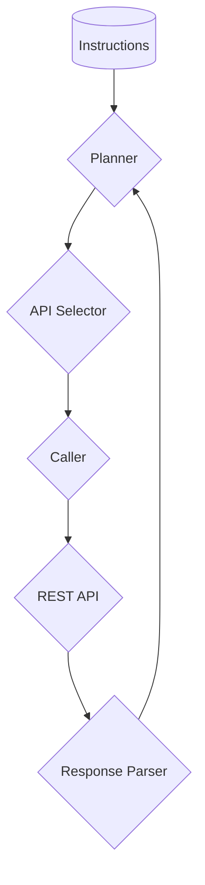
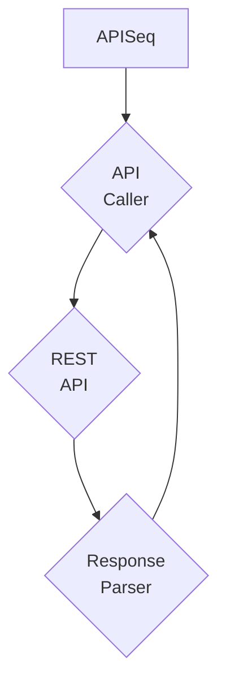
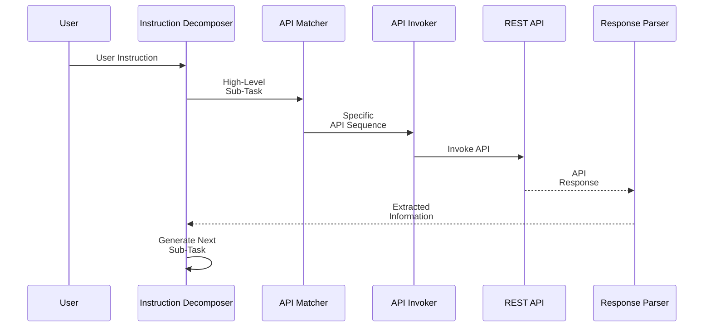
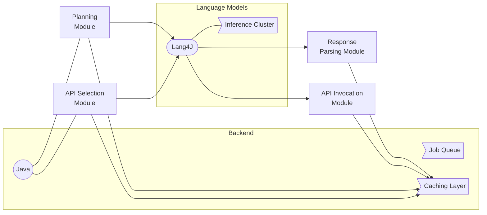

# APIAide: Connecting Large Language Models with REST APIs

## Introduction

APIAide enables large language models (LLMs) to understand OpenAPI specifications of REST APIs and make API calls to accomplish complex user instructions.

Interacting with production APIs has challenges like:

- Consuming extensive documentation across parameters, schemas
- Planning optimal sequences of API calls
- Handling authentication, marshaling arguments, parsing tricky responses

APIAide augments LLMs to overcome these via four capabilities:

* **REST API Comprehension:** Ingest OpenAPI specifications for LLMs to understand API semantics
* **Task Decomposition:** Break down instructions into coherent API call sequences using learned policies
* **API Parameterization:** Handle auth, arguments to correctly invoke APIs
* **Response Parsing:** Reliably extract information from API outputs using response schemas

This handles real-world API complexity. Next, we cover the techniques powering APIAide.


## Mathematical Foundations

APIAide harnesses mathematical models to power its ability to interact with complex real-world APIs reliably. Specifically, Markov Decision Processes enable optimized planning, vector embeddings facilitate accurate API matching, and policy learning parsers handle tricky JSON responses.

These techniques allow APIAide to break down instructions, determine optimal sequences of API calls, configure parameters correctly, and extract information from outputs. The formal abstractions provide provable capabilities to extrapolate intelligently to new situations based on prior experiences.

The mathematical foundations supply APIAide the rigor required to operate at industrial grade. The composable structure also allows improving the specialized modules independently.

Enabled by mathematics, APIAide can take on intricate multi-step interactions with production APIs that otherwise remain out of reach. Let us explore its technical core.

### Markov Decision Processes for Effective Decomposition

Markov Decision Process (MDP) provides a mathematical framework for modeling decision making in situations where outcomes are partly random and partly under the control of a decision maker. It enables optimizing policies to maximize reward.

An MDP is defined by:

- **States (s)**: Represent the current state of the environment
- **Actions (a)**: Choices available to the decision maker in each state
- **Transition Function (P(s'|s,a))**: Probability of transitioning to next state s' by taking action a in current state s
- **Reward Function (R(s,a))**: Specifies scalar reward r for state s after action a
- **Discount Factor (γ)**: Controls priority for current vs future rewards

The aim is to learn a policy π(a|s) that decides the action a in state s, by maximizing cumulative discounted reward:

```
π* = argmaxπ ∑ P(s′|s, a) [R(s,a) + γV(s')]
```

Where V(s) is the value function that recursively accumulates rewards from current state onward per policy π.

In APIAide, the MDP formulation is:

- **States:** Encode partial progress on user's instruction
- **Actions:** Generate next natural language sub-task
- **Transition Function:** Depends on environment's API call outcomes
- **Reward:** +1 for successfully completing instruction, 0 otherwise

This allows the **Planner** module to learn an optimal policy to break down instructions into coherent sequences of sub-tasks for efficient API usage.

The policy maximizes the long term cumulative reward of fulfilling user instructions through dynamic programming over API call outcomes.

### Leveraging Embeddings for Optimal API Matching

Embeddings are dense vector representations that encode semantics of text sequences. APIAide's API Selector module uses embeddings to match user sub-tasks to optimal API sequences.

**Embeddings Generation**

Embeddings are generated for:

- **Sub-tasks (p)**: Encodes user's natural language sub-task intent
- **API Sequences (a)**: Encodes API call chains based on OpenAPI spec

These embeddings are extracted from the large language model using mean-pooling operation over token embeddings.

```
p, a ∈ Rd
```

Where,
- **d**: Embedding dimension size (typical values of 512, 768, 1024)

**Similarity Computation**

Cosine similarity between sub-task embedding ***p*** and API sequence embedding ***a*** is then calculated as:

```
similarity = cos(θ) = (p.a) / (||p||.||a||)
```

Where θ is the angle between the vectors p and a.

**API Selection**

The API sequence ã with maximum cosine similarity to the sub-task is selected:

```
ã = argmaxa cos(p, a)
```

This semantic matching retrieves the API call sequence best encoding the intent of the natural language sub-task.

**Key Benefits**

- Handles vocabulary mismatch between sub-tasks and APIs
- Understands conceptual similarities
- Robust to minor language variations

So vector similarities between embedded spaces act as the substrate for APIAide's logical planning.

### Parser Policy Learning for Optimal Code Generation

The parser learns a parameterized policy for generating Python code that extracts responses accurately.

**Policy Definition**

The policy π′θ is learned using parameters θ. It maps the response schema S and query q to parsing code c:

```
c = π'θ(S, q)
```

**Reinforcement Learning Formulation**

Policy gradient reinforcement learning is employed to optimize this policy by maximizing a reward.

The key components are:

- **State:** Response schema S, query q
- **Action:** Generate parsing code tokens
- **Reward:** Execution accuracy on unseen responses

**Policy Gradient Objective**

Mathematically, the parser maximizes the expected cumulative reward J using gradient ascent on policy parameters θ:

```
∇θ J(π′θ) = E [∇θ log π'θ(at|st) Rt]
```

Where,

- t indexes token generation timesteps when creating parsing code
- st is state, at is action, rt is reward at timestep t
- Rt is cumulative future reward from t

Intuitively, parameter updates nudge the policy towards token sequences that result in accurate Python code for parsing responses.

**Benefits**

By formulizing as a reinforcement learning problem, the parser can handle variability in JSON responses and improve over time through accrued experiences.

The learned policy enables optimally extracting information from tricky API responses.

### Applying Formal Models for Integrating OpenAPIs

The mathematical models enable standardized integration by providing common semantic frameworks for information exchange between components.

For example, the Markov Decision Process powering the planner provides provable ways to translate natural language instructions into plan state representations. This allows binding external state transition systems like ChatGPT API.

Similarly, the vector embeddings facilitate matching text to API sequences across vocabulary gaps. This technique allows discovering alignments between APIAide's internal actions and operation specifications exposed by external APIs.

Concretely, APIAide utilizes OpenAPIs from models like ChatGPT providing OpenAPI specifications for capabilities like text completions.

The interaction workflow becomes:

- **User Instruction**: Processed by APIAide Core
- **Mapped to OAS**: Via ontologies to ChatGPT's API Schema
- **ChatGPT Invocation**: Executed via generated bindings
- **Response Parsing**: Results consolidated back

Additionally, APIAide's modular architecture allows injecting other OpenAPIs, like image tagging systems exposing vector embedding based APIs.

By leaning on community standards like OpenAPI coupled with mathematical models acting as connective tissue, APIAide facilitates systemic integration rather than domain-specific optimization.

## System Architecture

APIAide features specialized modules and hierarchical planning with feedback:


### Modular Components



Tasks are divided into planning, API selection, calling and parsing for separation of concerns.

### API Plan Execution

The executor module handles executing the API sequence:



The caller CC handles authentication, parameterization to invoke the REST API RR.

The parser PP then processes the API response to extract relevant information.

### Multi-Level Planning Dynamically Adapts

Instead of creating all required API sequences upfront, APIAide employs a hierarchical planning approach with multiple levels of abstraction.

The key idea is to first create a high-level sub-task, and then map it to a detailed API call sequence. This provides flexibility to dynamically adjust the planning based on execution outcomes.

Workflow Steps

The iterative workflow is:

Decompose Query: Break down instruction into a high-level natural language sub-task
Match APIs: Select API sequence to accomplish the sub-task
Invoke APIs: Call APIs by preparing arguments, authorization etc.
Parse Response: Extract information from API output
Revise Sub-Task: Use extracted info to create next sub-task
Benefits

Handles unforeseen scenarios during execution
Avoids recreating entire plan from scratch
Adjusts to feedback through hierarchical structure
For example, if authentication fails, the framework can just replan the steps rather than planning from scratch.

This hierarchical planning centered around high-level sub-tasks followed by detailed API sequences enables APIAide to robustly handle complexity of production APIs.



The **Instruction Decomposer** module first breaks down the complex user instruction into a high-level natural language sub-task.

The **API Matcher** then understands the sub-task intent and selects the appropriate sequence of REST API calls to accomplish it.

Then the **API Invoker** handles authentication, parameterization and actually invokes the APIs, getting the raw response.

The **Response Parser** processes this response based on API schemas to extract relevant information.

Finally, the **Instruction Decomposer** uses this extracted info to create the next sub-task, and the loop continues.

This two-level hierarchy of creating high-level sub-tasks first and then matching them to detailed API call sequences provides flexibility. Based on execution outcomes, the sub-tasks can be revised dynamically.

For example, if authentication fails while invoking an API, the framework can replan the steps without needing to recreate everything from scratch.

This adaptive nature enables APIAide to handle unforeseen scenarios when working with production REST APIs.


## Scalable and Flexible Implementation

APIAide is designed to be technology-agnostic and can be implemented in various stacks. A robust reference architecture is shown below:



**Java and Supporting Platforms** provide the scale, concurrency and tooling required for robustness. The key components it handles are:

- Asynchronous **Job Queue** for high throughput
- Distributed **Caching** for low latency
- Logging, Monitoring and Alerting capabilities

**Lang4J** serves as the interface to LLMs providing the intelligence required for planning, API selection etc.

For scale, multiple **Inference Instances** can be launched to handle heavy loads.

The workflow is:

1. Inputs first checked in cache
2. Cache misses queued as async jobs
3. Jobs processed by Lang4J + LLMs
4. Outputs cached

**Benefits**

- Leverages maturity of Java ecosystem
- Horizontally scalable for load handling
- Simplifies infra and deployment

This blueprint combines stability and intelligence to offer a robust API interaction platform.


## Technology Stack Powering APIAide

APIAide employs a robust tech stack to offer stability, scalability and ease of use.

| Layer | Technology | Responsibilities |
|-|-|-|  
| Platform | Java, Spring Boot | Scale, concurrency, monitoring |   
| Delivery | Kubernetes, Docker | CI/CD, high availability |
| Intelligence | LangChain, LLMs | Planning, parsing capabilities |
| Data | MongoDB, Elasticsearch | Storage, analysis ready data |
| Infrastructure | AWS, GCP | Reliability, security, compliance |

**Platform Layer**

Java and Spring Boot provide a high performance backend with dependency injection, web servicing and operational tooling baked in.

**Delivery Layer**

Containerized deployment on Kubernetes clusters provides portability across cloud providers while handling scale and uptime through infra automation.

**Intelligence Layer**

Framework like LangChain offer a clean interface for large language models to drive planning and response parsing logic.

**Data Layer**

Managed document stores like MongoDB and search engines like Elasticsearch provide the data storage and analytical capabilities.

**Infrastructure Layer**

By leveraging cloud infrastructure, the solution can meet security, compliance and reliability requirements out-of-the-box without own hosting.

Together these layers deliver an enterprise-grade platform for deploying APIAide capabilities for production usages with minimal risks.

## Assessing Generalization Across Complexity Frontiers

APIAide is evaluated across diverse dimensions spanning varying levels of complexity using real-world Spotify and TMDB APIs.

**Production-Grade APIs**

- TMDB: Movie database with 54 endpoints
- Spotify: Music platform with 40 APIs

**Testing Corpus**

100+ human annotated instructions covering:

- Query complexity levels
- API combinations required
- Parameter configurations

**Evaluation Dimensions**

- **Accuracy** across query complexity spectrum
- **Planning Efficiency** via gap between predicted and actual API sequences
- **Scalability** by increasing number of callable APIs

**Analysis Framework**

By tracing performance gradients instead of aggregate scores, granular insights emerge on strengths and areas needing improvement.

For example, decrement in success rate for longer instruction chains reveals challenges to scale to complex workflows.

**Results Summary**

| Metric | Outcome |
|-|-|  
| Correct API Call Chains | 79% |
| End-to-End Success Rate | 75% |

**Use Case**

*Create playlist "Love Coldplay" with most popular songs by artist*

**Key Takeaways**

✅ Assesses across complexity frontiers spanning simplicity to intricate multi-hop scenarios

✅ Quantifies scaling behavior on critical dimensions

✅ Provides confidence in handling real-world production complexity

The rigorous methodology evaluates the spectrum of capabilities required in deployment - understanding, planning, configuring and extracting information from APIs.

## Future Work

While results are encouraging, challenges remain:

- Performance drop on longer sequence lengths
- Brittleness to unseen APIs
- Blackbox failure modes of LLMs

Continued research across model design, testing and transparency is required to make systems like APIAide robust enough for production use.

## High-Impact Application Areas

While the initial focus has been on ad-hoc instructions, APIAide has promising potential to drive impact across multiple domains:

**Retail & Ecommerce**

- Catalog management workflows
- Personalization driven by CRM data
- Order fulfillment orchestration

**Healthcare**

- Patient record management
- Insurance claim processing
- Drug discovery pipelines

**Finance**

- Investment research automation
- Risk analysis decisioning
- Regulatory compliance

**Transportation & Logistics**

- Fleet route optimization
- Warehouse task coordination
- Delivery workflow orchestration

The capabilities to understand APIs, decompose tasks, invoke services and consolidate responses can unlock new efficiencies.


## High-Impact Application Areas

While the initial focus has been on ad-hoc instructions, APIAide has promising potential to drive impact across multiple domains:

**Retail & Ecommerce**

- Catalog management workflows
- Personalization driven by CRM data
- Order fulfillment orchestration

**Healthcare**

- Patient record management
- Insurance claim processing
- Drug discovery pipelines

**Finance**

- Investment research automation
- Risk analysis decisioning
- Regulatory compliance

**Transportation & Logistics**

- Fleet route optimization
- Warehouse task coordination
- Delivery workflow orchestration

**Personalization and Recommendations**

- Build dynamic customer segments based on CRM data
- Make real-time product suggestions across channels
- Orchestrate data from catalog, inventory, browsing history etc.

**Customer Journey Optimization**

- Choose optimal channels and content for each segment
- Coordinate messaging across email, web, app push
- React to emerging trends and sales events

**Advertising and Promotion**

- Create and rapidly iterate ad campaigns
- Integrate performance data from multiple analytics sources
- Adjust bids and budgets to optimize ROI

**Sentiment and Market Analysis**

- Scrape public social data to detect trends
- Combine reviews, ratings, mentions into single dashboard
- Feed insights into product, pricing decisions


The capabilities to understand APIs, decompose tasks, invoke services and consolidate responses can unlock new efficiencies.

As APIAide matures, it can transition from serving individuals to powering large-scale automated orchestration between organizational systems.

### Vast Potential with Democratization

Furthermore, by hiding complexity behind a conversational interface, APIAide promises to democratize API usage for less technical users.

Subject matter experts in areas like medicine, logistics etc. can focus on core problems while APIAide handles the drudgery of integration.

This shift towards empowering more domain experts also expands the possibility frontier for AI systems to positively impact domains.

Thus the addressable use cases for large language model based orchestrators scale manifold as the interfaces become accessible to non-programmers. The future is promising!